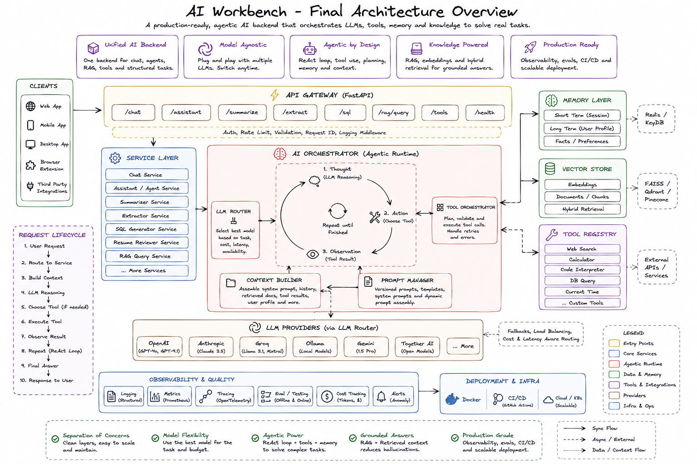

# LLM engine

> Build production-grade LLM applications from first principles.

Workbench is a progressive AI backend that evolves from a simple LLM API into a production-style AI platform. Core AI concepts are implemented manually before introducing framework integrations. Each release adds a new capability to the runtime while preserving previous implementations for educational comparison and architectural clarity.

---

## Architecture



```text
Clients
    │
    ▼
API Gateway (FastAPI)
    │
    ▼
Feature Layer
(Chat • Assistant • Structured APIs • RAG)
    │
    ▼
AI Runtime
(LLM Orchestrator • ReAct • Planning • Context Builder)
    │
    ├──────────────┬──────────────┬──────────────┐
    ▼              ▼              ▼              ▼
Providers      Tool Runtime     Memory      Knowledge
(Groq)         (Registry)       (Redis)     (Vector DB)
    │              │              │              │
    └──────────────┴──────────────┴──────────────┘
                   ▼
        Observability & Deployment
```

See [docs/architecture.md](docs/architecture.md) for the full technical deep-dive.

---

## Key Features

**v0.3.0 — Tool Runtime** *(current)*

- FastAPI backend with structured request/response schemas
- LLM integration via Groq with provider abstraction
- Tool registry with dynamic registration and execution
- Function calling with calculator, current time, and UUID tools
- AI assistant endpoint with tool-calling loop
- Prompt management system with markdown templates
- Chat, summarization, entity extraction, code explanation, and SQL generation endpoints
- Streaming support for chat responses

---

## Version Roadmap

| Version | Milestone | Status |
|---------|-----------|--------|
| v0.3.0 | Tool Runtime | ✅ Current |
| v0.4.0 | Agent Runtime (ReAct, Memory) | Planned |
| v0.5.0 | Memory & State (Redis) | Planned |
| v0.6.0 | Knowledge (RAG) | Planned |
| v0.7.0 | Framework Integrations | Planned |
| v0.8.0 | Evaluation | Planned |
| v0.9.0 | Portfolio Apps | Planned |
| v1.0.0 | Production | Planned |

See [docs/roadmap.md](docs/roadmap.md) for detailed deliverables.

---

## Project Structure

```text
ai-workbench/
├── app/                    # Application source
│   ├── api/                # FastAPI route handlers
│   ├── core/               # Configuration and settings
│   ├── llm/                # LLM client (Groq)
│   ├── prompts/            # Markdown prompt templates
│   ├── schemas/            # Pydantic request/response models
│   ├── services/           # Business logic
│   ├── tools/              # Tool implementations and registry
│   ├── memory/             # Conversation memory (v0.4+)
│   └── main.py             # FastAPI application entry point
├── frameworks/             # Framework implementations (v0.7+)
├── apps/                   # Portfolio applications (v0.9+)
├── tests/                  # Test suite
├── docs/                   # Documentation
└── pyproject.toml
```

---

## Getting Started

### Prerequisites

- Python 3.12+
- [uv](https://docs.astral.sh/uv/) package manager
- Groq API key

### Setup

```bash
git clone https://github.com/your-username/ai-workbench.git
cd ai-workbench

# Install dependencies
uv sync

# Configure environment
cp .env.example .env
# Add your GROQ_API_KEY to .env

# Run the development server
uv run fastapi dev app/main.py
```

The API will be available at `http://localhost:8000`. Interactive docs at `http://localhost:8000/docs`.

### API Endpoints

| Method | Endpoint | Description |
|--------|----------|-------------|
| `POST` | `/chat` | Chat completion |
| `POST` | `/chat/stream` | Streaming chat |
| `POST` | `/assistant` | AI assistant with tool calling |
| `POST` | `/summarize` | Text summarization |
| `POST` | `/extract` | Entity extraction |
| `POST` | `/code/explain` | Code explanation |
| `POST` | `/sql/generate` | SQL generation |
| `GET` | `/health` | Health check |

---

## Documentation

- [Architecture](docs/architecture.md) — System design and request lifecycle
- [Roadmap](docs/roadmap.md) — Version plan and deliverables
- [Changelog](docs/changelog.md) — Release history
- [Decisions](docs/decisions.md) — Architectural decision records

---

## Philosophy

> Every abstraction must be **earned**, not copied from tutorials.

This project follows a first-principles approach:

1. Understand the concept
2. Design the abstraction
3. Build it manually
4. Compare with frameworks later

No high-level orchestration frameworks until the primitives are understood.
