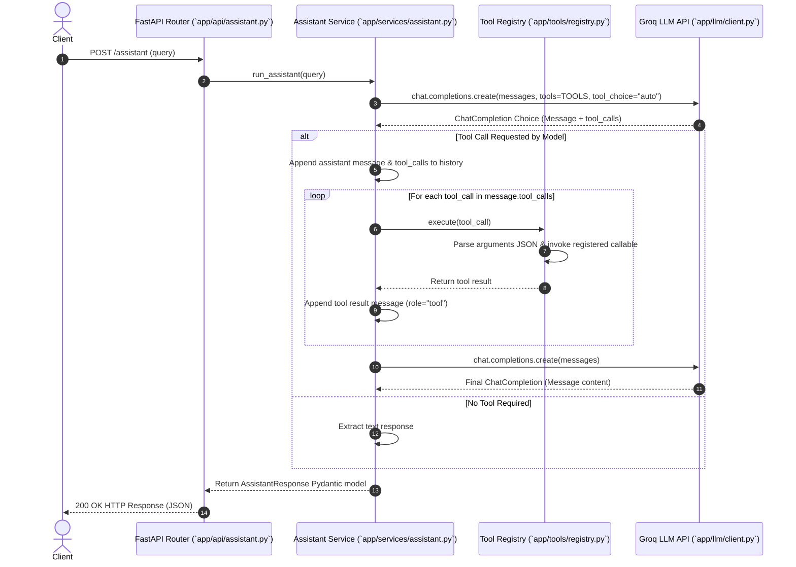

# Architecture

## 1. Overview

AI Workbench is built as a layered FastAPI backend designed for modularity, low latency, and continuous evolution from basic LLM integration to a full production AI platform. The system abstracts model provider interactions, prompt management, and tool execution into distinct architectural layers.

```
Clients (HTTP REST)
       │
       ▼
API Gateway Layer (`app/api/`)
       │
       ▼
Feature & Service Layer (`app/services/`)
       │
       ▼
AI Runtime Layer (`app/llm/`, `app/tools/`, `app/prompts/`)
       │
       ├───────────────────┬───────────────────┐
       ▼                   ▼                   ▼
External Providers     Tool Registry        Prompt Storage
 (Groq LLM API)      (`app/tools/`)       (`app/prompts/`)
```

The system architecture comprises five main layers:

- **Client Layer**: External applications and HTTP clients consuming RESTful endpoints.
- **API Gateway Layer**: FastAPI route handlers (`app/api/`) managing request validation, openapi generation, status code mapping, and response serialization.
- **Feature & Service Layer**: Core business logic modules (`app/services/`) that coordinate prompt loading, message payload construction, and response transformation.
- **AI Runtime Layer**: Core orchestration logic, including the provider client wrapper (`app/llm/client.py`), tool execution engine (`app/tools/registry.py`), and prompt loading system (`app/prompts/`).
- **Providers / Tools / Storage**: External LLM services (Groq), deterministically registered Python tool functions, and template resources.

## 2. Request Lifecycle

The lifecycle of an assistant request with tool calling follows a multi-phase flow: request validation, initial LLM invocation, optional tool decision handling, tool execution, secondary LLM synthesis, and response delivery.



### Detailed Lifecycle Phases

1. **HTTP Ingestion**: The client sends a payload containing the user query to `POST /assistant`. FastAPI parses and validates the payload using Pydantic schemas defined in `app/schemas/requests.py`.
2. **Service Delegation**: The endpoint delegates execution to `run_assistant()` in `app/services/assistant.py`.
3. **Context Assembly**: The service initializes the message array with system instructions and user input, binding the tool definitions (`TOOLS` from `app/schemas/tools.py`).
4. **Primary Inference**: `app/llm/client.py` transmits the request to Groq API.
5. **Tool Evaluation & Dispatch**:
   - If the model returns `tool_calls`, the service records tool metadata in message history and invokes `registry.execute()` in `app/tools/registry.py`.
   - The tool function executes locally and returns a stringified payload.
   - The execution result is appended to the message array under the `tool` role with matching `tool_call_id`.
6. **Secondary Inference**: A second call is made to Groq API with updated message history containing tool results to synthesize a final answer.
7. **Response Formatting**: Latency is measured via high-resolution monotonic clocks (`time.perf_counter()`), and the result is returned as an `AssistantResponse` object.

## 3. LLM Orchestrator

The LLM orchestration system decouples provider SDK initializations from application feature logic.

### Provider Integration (`app/llm/client.py`)

The LLM client initializes the Groq client instance singleton using configuration loaded from `app/core/config.py`:

```python
from groq import Groq
from app.core.config import settings

client = Groq(api_key=settings.groq_api_key)
```

Configuration parameters (e.g., target model, API credentials) are managed centrally via Pydantic BaseSettings, reading environment variables like `GROQ_API_KEY` and default model identifiers.

### Assistant Service (`app/services/assistant.py`)

The assistant service manages the invocation loop for multi-turn function execution:

1. **System Prompt Configuration**: Injects structural operational requirements, such as forcing empty JSON objects `{}` for parameterless tools (`fetch_uuid`, `current_time`).
2. **Tool Bindings**: Attaches JSON Schema tool specifications (`TOOLS`) to the completion request with `tool_choice="auto"`.
3. **Execution Loop**: Intercepts `tool_calls` arrays in the response message. Iterates over requested functions, dispatches execution calls to `ToolRegistry`, and appends tool output objects back to the prompt context array before triggering final completion.
4. **Metrics Tracking**: Captures start and end timestamps around the full execution pipeline to calculate overall latency (`latency_ms`).

## 4. Tool Runtime

The tool execution system is managed by `app/tools/registry.py`, which provides deterministic tool registration, argument decoding, execution dispatching, and error handling.

### Tool Registry Architecture

The `ToolRegistry` class maintains an internal dictionary mapping tool names to python callables.

```python
class ToolRegistry:
    def __init__(self):
        self.tools = {}

    def register(self, name: str, func: callable):
        self.tools[name] = func

    def get(self, name: str):
        return self.tools.get(name)

    def execute(self, tool_call):
        ...
```

### Argument Parsing and Error Isolation

When `registry.execute(tool_call)` is invoked:
- It extracts `tool_call.function.name` and fetches the corresponding callable.
- It decodes `tool_call.function.arguments` from JSON string format into a Python `dict`.
- If JSON parsing fails (`json.JSONDecodeError`), it logs the error and returns a structured error object `{"error": "Failed to parse tool arguments: ..."}`.
- If argument mapping fails (`TypeError` due to missing or extra parameters), it catches the exception and returns `{"error": "Invalid arguments provided for tool: ..."}`.
- Exceptions during tool execution do not crash the API process; instead, error payloads are passed back to the LLM so the model can report or correct the issue.

### Active Tools

The runtime currently exposes three built-in tools:

| Tool Name | Source Module | Description | Inputs |
|---|---|---|---|
| `calculate` | `app/tools/calculator.py` | Evaluates arithmetic math expressions safely | `expression: str` |
| `current_time` | `app/tools/current_time.py` | Returns current ISO 8601 timestamp string | None |
| `uuid` | `app/tools/uuid.py` | Generates a version 4 random UUID string | None |

## 5. Prompt Management

Prompts in AI Workbench are managed as first-class software assets separated from code logic.

### File-Based Templates

Prompts are written as Markdown (`.md`) files stored inside `app/prompts/`:
- `app/prompts/agent.md`: Default system instructions for general agent operations.
- `app/prompts/explainer.md`: Formatting instructions for code explanation endpoints.
- `app/prompts/extraction.md`: Schema rules for structured information extraction.
- `app/prompts/sql_generator.md`: SQL dialect and schema formatting constraints.
- `app/prompts/summarize.md`: Rules for text summarization.

### Import-Time Prompt Loader (`app/prompts/__init__.py`)

Prompt files are scanned and loaded into an in-memory dictionary during module initialization:

```python
from pathlib import Path

PROMPT_DIR = Path(__file__).parent
prompts = {}

for prompt_file in PROMPT_DIR.glob("*.md"):
    prompt_name = prompt_file.stem
    prompts[prompt_name] = prompt_file.read_text(encoding="utf-8")

def loader(promptFile: str):
    return prompts.get(promptFile)
```

This ensures file I/O overhead occurs once during server startup, providing zero-latency prompt lookups during request execution while allowing prompt templates to be maintained in clean Markdown files.

## 6. ReAct Loop (Planned - v0.4)

The ReAct (Reasoning and Acting) loop will introduce iterative multi-step reasoning capability to the assistant.

### Planned Architecture

Currently, the v0.3.0 assistant executes a single tool invocation turn. Version 0.4 will introduce a bounded state machine that implements the ReAct pattern:

1. **Reason**: The model generates a thought reasoning step describing what actions to take.
2. **Act**: The model selects and invokes one or more tools.
3. **Observe**: The runtime captures tool output logs and appends them to context.
4. **Evaluate Loop Termination**: The orchestrator evaluates if the task objective is complete or if further Reason-Act iterations are required up to a maximum step limit (e.g., `max_iterations=5`).

```
      ┌────────────────────────────────┐
      ▼                                │
[Reason Step] ──► [Act Step] ──► [Observe Output]
      │
      └─► (Termination Condition / Final Answer) ──► Output
```

## 7. Memory (Planned - v0.4+)

Stateful conversation tracking will be added in v0.4+.

### Planned Implementation

- **Session Store**: In-memory session key-value cache indexed by `session_id`.
- **Sliding Context Window**: Buffer memory keeping recent conversation turns up to context token thresholds.
- **Token Trimming**: Automated truncation strategies (FIFO message dropping or summarization heuristics) when total token count approaches model context limits.

## 8. RAG System (Planned - v0.6+)

Retrieval-Augmented Generation will enable knowledge extraction over external document corpora.

### Planned Implementation

- **Ingestion Pipeline**: Document loading, text splitting, chunking, and metadata tagging.
- **Embedding Generation**: Vector embedding generation via dedicated embedding models.
- **Vector Store Integration**: Vector database integration (e.g., Qdrant or ChromaDB) for semantic similarity search.
- **Retrieval Engine**: Hybrid search (dense vector + sparse keyword search) injecting relevant contexts into endpoint prompts before inference.

## 9. Observability (Planned - v1.0)

Production telemetry and monitoring infrastructure.

### Planned Implementation

- **OpenTelemetry Tracing**: End-to-end tracing across HTTP handlers, service calls, LLM requests, and tool executions.
- **Latency Categorization**: Breakdown of total request time into Gateway, LLM API network round-trips, and tool execution phases.
- **Token Usage Accounting**: Tracking input, output, and cumulative token consumption per endpoint and model.
- **Structured JSON Logging**: Centralized log collection compatible with standard log analyzers.

## 10. Deployment (Planned)

Production deployment strategy and infrastructure topology.

### Planned Architecture

- **Containerization**: Multi-stage Docker builds optimizing image sizes and dependency caching.
- **ASGI Server Configuration**: Production deployment using Uvicorn workers managed by Gunicorn or run natively under Kubernetes.
- **Environment Management**: Environment variable validation and secret management via vault services or cloud key managers.
- **Scalability**: Stateless service design allowing horizontal auto-scaling based on CPU utilization and incoming HTTP request volume.
